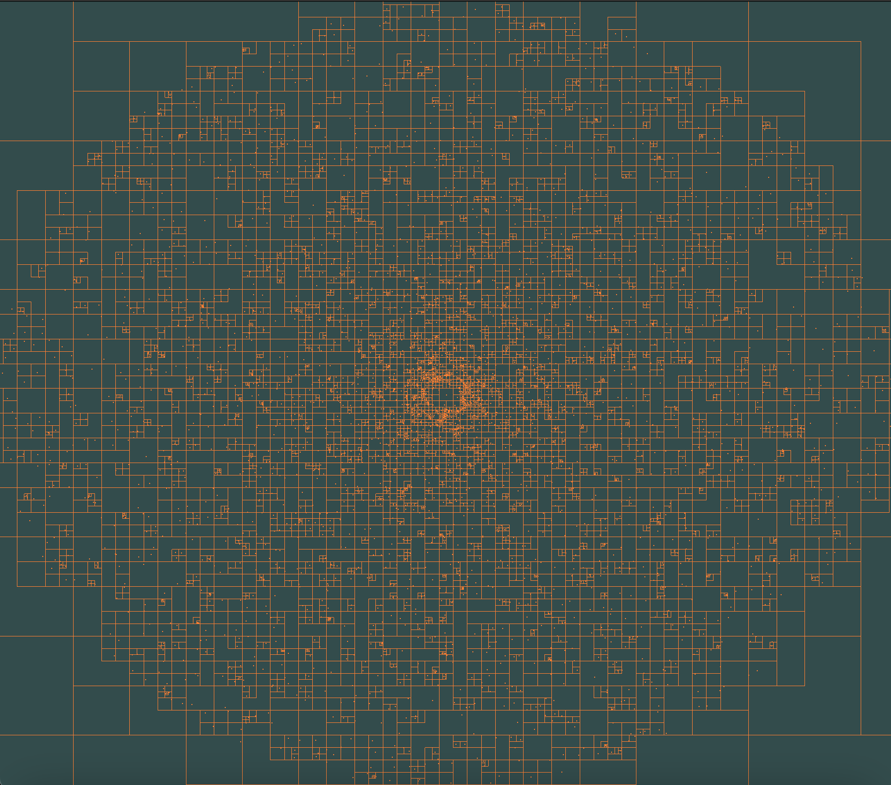

The image shows the simulated masses along with the tree generated for force calculations.

The code implements a barnes-hut algorithm for n-body simulations using Euler integration.
The graphics are done using GLFW. 
The only other external dependency is glad.

The code structure is largely inspired by jdah/minecraft-weekend.
